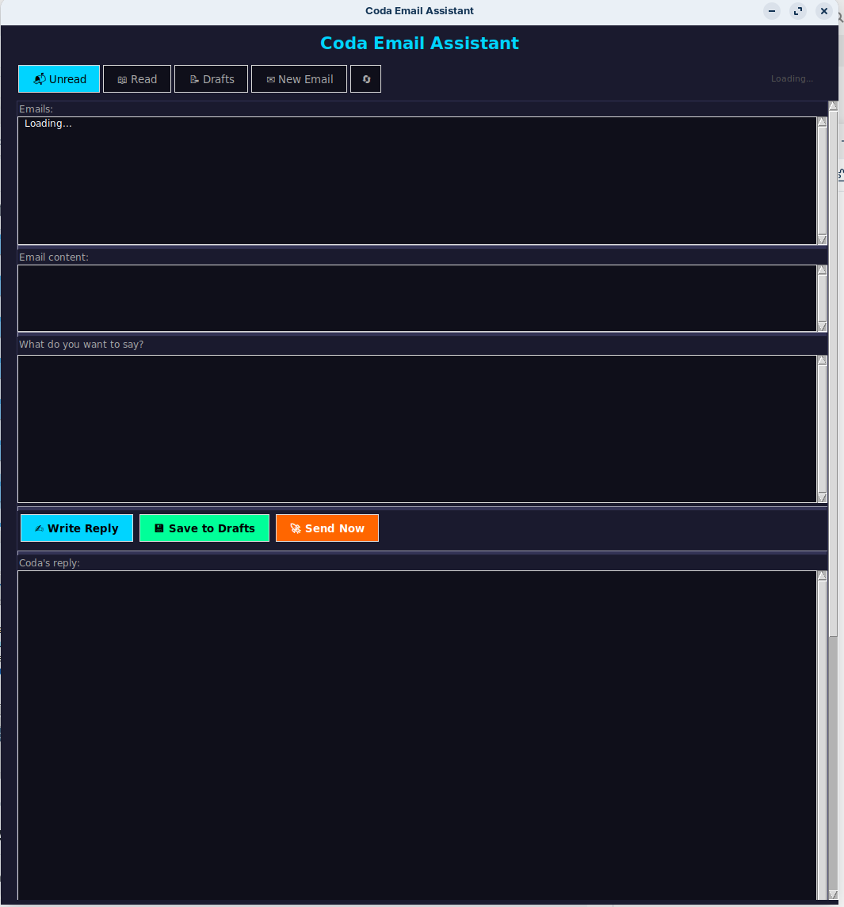
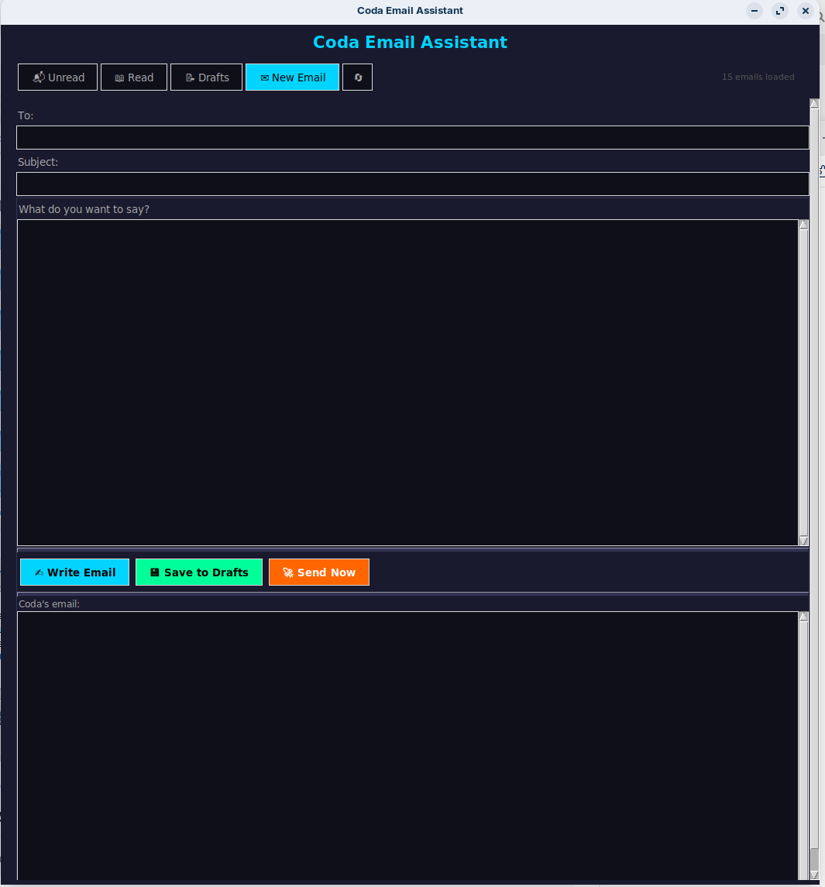

# Coda 🤖

> **Your local AI assistant. Right-click any folder to code. Write emails in plain language. No subscription. No cloud. No limits.**

I was fed up with AI subscriptions and hitting limits constantly. So I built my own offline AI assistant that lives on my machine, knows my files, writes my emails, and costs nothing to run.

This is Coda — a coding assistant and email agent integrated directly into your Linux desktop, sitting quietly in your system tray until you need it.

---

## Features at a Glance

| Feature | Description |
|---|---|
| **System tray** | C icon lives in your taskbar, always one click away |
| **Right-click → Call Coda** | Opens a coding session in any folder from the file manager |
| **Launch Coda** | Folder picker from the tray to start a coding session anywhere |
| **Terminal badge** | Red number on the C icon shows how many coding sessions are open |
| **Email Agent** | Reads inbox, writes replies, saves to Drafts or sends — all from one window |
| **Model switcher** | Switch AI provider instantly from the tray, no need to open Preferences |
| **Separate AI per task** | Use local Ollama for coding and Gemini free for email, or any combination |
| **Preferences window** | Configure everything from a clean UI — no config files to edit |
| **Single-instance windows** | Email Agent and Preferences hide when you close them, reopen instantly from tray |
| **Privacy first** | Cloud providers shown a warning before processing your emails |
| **Aider-powered coding** | Git commit on every change, `/undo`, `/diff`, full file editing |

---

## Screenshots





---

## Coding Assistant

Right-click any project folder in your file manager → **Call Coda**.
A terminal opens with your AI ready to work on your files:

```
> create a weather app with vanilla HTML CSS and JS
> fix the temperature conversion bug in app.js
> add a dark mode toggle to index.html
> explain what this function does
```

Every change Coda makes is automatically committed to git with a description.
Type `/undo` to roll back the last change instantly.

You can also launch from the tray (**C → Launch Coda** → pick a folder) or from the terminal:

```bash
cd ~/my-project
coda
```

### Useful Aider commands inside a session

```
/add .          add all project files to the session
/add index.html add a specific file
/undo           roll back the last change
/diff           see exactly what changed
/ask            ask a question without editing any files
/git            show git log of Coda's commits
/exit           quit
```

---

## Email Agent

**C → Email Agent** in your system tray opens the email window.

- **Four tabs** — Unread, Read, Drafts, New Email
- **Select any email** — Coda reads it for context
- **Describe your reply in plain language** — *"tell him Tuesday works, ask about the budget"*
- **Coda writes the full professional email**
- **Save to Drafts** — appears in Gmail ready to review and send
- **Send Now** — sends directly without leaving Coda
- **New Email tab** — write brand new emails the same way
- **Auto-refresh** — inbox updates automatically every 5 minutes
- **All panels resizable** — drag dividers to adjust any section to your preference

Closing the email window with X does **not** quit it — it stays alive in the background.
Click **C → Email Agent** again and it reappears instantly, with your inbox already loaded.

It only fully closes when you choose **Quit** from the tray.

Coda connects directly to your email account over IMAP/SMTP using an App Password.
Your emails never touch a third-party server unless you choose a cloud AI provider for email — in which case Coda shows a privacy warning before proceeding.


---

## Model Switcher

**C → Switch Model** in the tray lets you change your AI provider instantly — no need to open Preferences.

```
C
├── Launch Coda
├── Email Agent
├── ──────────
├── Model: Ollama (local)   ← shows active provider
├── Switch Model ▶
│     ├── 🏠  Ollama (local)   ✓
│     ├── 🔵  Gemini
│     ├── 🟢  OpenAI
│     └── 🟠  Claude
├── ──────────
├── Preferences
└── Quit
```

If you switch to a cloud provider and haven't added an API key yet, Coda reminds you to open Preferences first.

---

## Separate AI for Coding and Email

In **Preferences → Email tab** you can choose a different AI provider for the Email Agent than the one used for coding.

For example:
- **Coding** — Ollama local model (private, no cost, always available)
- **Email** — Gemini free tier (more capable for writing, processes email content externally)

Or keep both on local Ollama for complete privacy.

---

## Supported AI Providers

| Provider | Free tier | Works for |
|---|---|---|
| Ollama (local) | ✓ free forever | Coding + Email |
| Gemini | ✓ free tier | Coding + Email |
| Claude API | paid | Coding + Email |
| OpenAI | paid | Coding + Email |

Get a free Gemini API key at [aistudio.google.com](https://aistudio.google.com).

---

## Requirements

- Linux — Debian/Ubuntu based (tested on Zorin OS and Ubuntu)
- Python 3
- Nautilus file manager (GNOME)
- For local models: [Ollama](https://ollama.ai) running locally or on a server on your network
- For email: Gmail App Password, or any IMAP/SMTP provider

---

## Installation

### One-line install

```bash
curl -fsSL https://raw.githubusercontent.com/sebamuhr/Coda/main/install.sh | bash
```

The installer walks you through everything interactively:

1. Choose your AI provider (Ollama, Gemini, Claude, OpenAI)
2. Enter your server IP or API key
3. Pick your model
4. Set up the Email Agent (optional)
5. Everything is configured and running

### Manual install

<details>
<summary>Click to expand manual installation steps</summary>

**1. Install system dependencies**

```bash
sudo apt install python3 python3-pip python3-tk python3-venv \
    python3-nautilus gir1.2-ayatanaappindicator3-0.1 \
    wmctrl libnotify-bin
/usr/bin/pip3 install pystray pillow --break-system-packages
```

**2. Install Aider**

```bash
python3 -m venv ~/aider-env
source ~/aider-env/bin/activate
pip install aider-chat
```

**3. Download Coda**

```bash
mkdir -p ~/Coda
cd ~/Coda
curl -fsSL https://raw.githubusercontent.com/sebamuhr/Coda/main/coda-tray.py -o coda-tray.py
curl -fsSL https://raw.githubusercontent.com/sebamuhr/Coda/main/coda-email.py -o coda-email.py
curl -fsSL https://raw.githubusercontent.com/sebamuhr/Coda/main/coda-preferences.py -o coda-preferences.py
```

**4. Install the right-click extension**

```bash
sudo mkdir -p /usr/share/nautilus-python/extensions/
sudo curl -fsSL https://raw.githubusercontent.com/sebamuhr/Coda/main/coda_extension.py \
    -o /usr/share/nautilus-python/extensions/coda_extension.py
nautilus -q
```

**5. Create desktop entry and autostart**

```bash
mkdir -p ~/.local/share/applications ~/.config/autostart

cat > ~/.local/share/applications/coda.desktop << EOF
[Desktop Entry]
Type=Application
Name=Coda
Exec=/usr/bin/python3 $HOME/Coda/coda-tray.py
Icon=$HOME/.local/share/icons/coda.svg
Terminal=false
Categories=Development;Utility;
EOF

cp ~/.local/share/applications/coda.desktop ~/.config/autostart/coda.desktop
```

**6. Launch and configure**

```bash
/usr/bin/python3 ~/Coda/coda-tray.py &
```

Click **C → Preferences** and fill in your AI provider and email settings.

</details>

---

## How it all fits together

```
Your desktop
│
├── System tray  (C icon)
│   ├── Launch Coda  ──────────────► folder picker → coding terminal
│   ├── Email Agent  ──────────────► email window (hides on X, stays alive)
│   ├── Switch Model  ─────────────► change AI provider instantly
│   ├── Preferences  ──────────────► configure everything
│   └── Quit  ─────────────────────► closes everything cleanly
│
├── File manager right-click
│   └── Call Coda  ────────────────► coding terminal in that folder
│
└── Terminal
    └── coda  (or your alias)  ────► coding session in current folder
```

---

## Tips

- The **Call Coda** right-click option only appears when Coda is running — quit from the tray and it disappears automatically
- The **terminal badge** (red number on the C icon) shows how many coding sessions are open — from both the tray and right-click
- **Save to Drafts** is safer for email — review in Gmail before sending
- Use `/add .` in a coding session to let Coda see all your project files
- Keep coding instructions focused — one task at a time works best with local models
- Every coding change is a git commit — you always have a full history to roll back

---

## The Story

I'm a no-code developer. I started with Cursor AI and loved it — but the monthly subscription adds up fast, especially when you hit the limits. I wanted something I owned, something offline, something that didn't send my code to servers I don't control.

Coda is what I built. It's [Aider](https://aider.chat) + [Ollama](https://ollama.ai) + Python glue that integrates the whole thing into your Linux desktop. A coding assistant, an email agent, a model switcher, a preferences window — all in one system tray icon that starts with your computer.

Nothing fancy. Just works.

---

## Contributing

Pull requests welcome! Ideas for improvement:

- Support for other file managers (Dolphin, Thunar)
- Windows / Mac support
- More email providers and OAuth support
- Calendar integration
- Multiple Ollama server profiles

---

## License

MIT — do whatever you want with it.

---

*Built with frustration, coffee, and a lot of help from Claude* ☕
